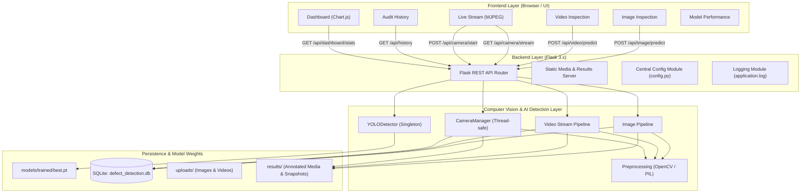

# System Architecture

## Architecture Diagram

## Modular Components

1. **`config.py`**: Central source of truth for defect classes, thresholds, and paths.
2. **`backend/detection/detector.py`**: Singleton YOLO wrapper with graceful handling of missing model weights.
3. **`backend/detection/camera_detector.py`**: Background camera thread with MJPEG multipart generator.
4. **`backend/database/`**: SQLAlchemy models with foreign key constraints, cascading deletes, and pagination.
5. **`frontend/`**: Vanilla HTML5, CSS3, Chart.js, and modular JS clients.
